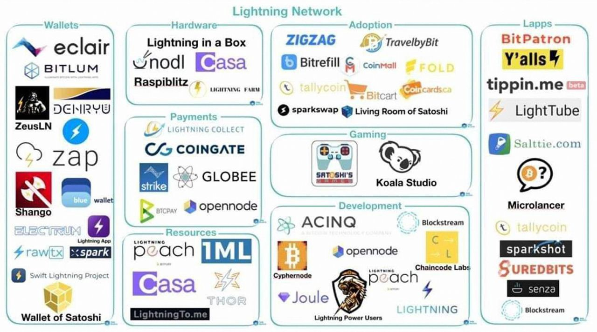
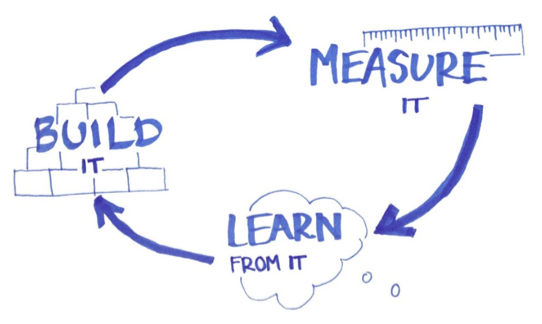

## Appendix II - Business modeling in the Bitcoin Lightning Network Ecosystem, by Federico Spitaleri (satoshis.games) ##

**Introduction**

This article aims at providing Lapps (Lightning Network applications) with valuable insights about the Lightning Network ecosystem that will help them to build a successful business model.

We&#39;ll go through the major sections of a Business Model Canvas and present some case studies of Lapps that already operate in the market. We&#39;ll have a look at what resources are necessary for Lapps to operate, what is their value proposition, how they deliver their value proposition to their target market and finally how they monetize.

It is important to mention that Lightning users still represent a very small market niche, therefore many of the models presented here would require more Lightning Network users in order to become profitable. However, designing a business model that not only uses a trending technology but also does that in a scalable way is a good practice in order to prepare for when the niche of Lightning users will be big enough to allow Lapps to generate significant profits.

**Business models in the Lightning ecosystem**

A business model describes how organizations create, deliver and gather value. It also identifies key interactions and collaborations with suppliers, customers and other actors that operate in the market.

In the present paragraph we&#39;re going to explore the new value propositions that the Lightning Network brings, the ways those value propositions are delivered to the customers, the resources that are necessary for Lapps to operate in the market, the costs that Lapps have to bear and finally the available options for Lapps to make revenue.

_Business Model Canvas. Source: strategyzer.com_

**Value proposition**

It represents the value that Lapps offer to their target market. When startups build a Lapp they need to ask them-selves the following questions: what was impossible before the advent of the Lightning Network?
 How can their Lapp make it possible?
 What can their Lapp do more efficiently/effectively than other companies that offer the same product/service but don&#39;t use the Lightning Network?
 Does their Lapp solve any problem/satisfy any need?

Let&#39;s start by making a list of features that the Lightning Network offers; we&#39;ll then have a look at some examples of Lapps&#39; value propositions.

Lightning Network&#39;s features:

1. Instant and cheap transferring of value;
2. Micro-transactions;
3. Private transactions;
4. Automatic withdrawal of **any amount** (even fractions of Euro cents) **at any time** ;
5. New methods for authenticating users (proof-of-payment and digital signatures based on Node IDs)

Examples of Lapps&#39; value propositions:

[**Tippin.me**](https://tippin.me/): it allows people to send and receive tips in an easy, cheap and instant way. In addition, tips can be very small (fractions of Euro cents) so that the sender can tip any amount and the receiver can accumulate those amounts and withdraw at any time. Through a browser extension it is also possible to tip tweets on Twitter by clicking on a specific icon next to the &quot;like&quot; button;

[**Satoshis.games**](https://satoshis.games/): it allows users to earn Bitcoin by playing games. Within the gaming platform, the transferring of value is not unidirectional (from the user to the platform: pay-to-play system) but bidirectional (from the user to the platform and from the platform to the user). Satoshis.games uses Bitcoin as a currency within the games, so that such currency is not platform-dependent and the in-game micro-economy is not fictitious (value can be extracted from the platform and spent on other Lapps or in everyday life). Finally, digital elements within the games (e.g. Super Mario coins) have a real value and such value can be instantly withdrawn at any time and at zero cost. Every digital action on Satoshis.games can be monetized or rewarded;

[**Gab**](https://gab.com/): it&#39;s a fork of the Brave browser. Gab&#39;s team is working on an implementation that will pay users for watching advertisements while browsing the web. The advantage on the users&#39; side is that they can be rewarded even for a &quot;micro-usage&quot; of the browser and such remuneration is paid through a &quot;real time&quot; micro-transaction that can be withdrawn at any time;

[**Sats 4 Likes**](https://kriptode.com/satsforlikes/index.html): it&#39;s a Lapp that rewards users for sharing and liking posts on social media. Companies or individuals that want to advertise their products on social media publish a task on Sats 4 Likes and specify how much users will be paid for sharing/liking/commenting a post. They then pay an invoice to Sats 4 Likes which then pays the users when they complete the task. The value proposition consists in rewarding &quot;micro-tasks&quot; with micro-transactions (fair enough), making advertisers pay for concrete, valuable and specific actions instead of impressions or clicks. In addition, Sats 4 Likes represents a channel through which it&#39;s possible to target Bitcoin and Lightning Network users in a very direct and effective manner: rewarding users only with Bitcoin allows solely for Bitcoin users to be reached. Targeting Bitcoiners on traditional channels is instead very complicated as social media like Facebook, Instagram and Twitter cannot provide such detailed targeting parameters able to optimize the budget reaching only actual Bitcoin users;

[**Suredbits**](https://suredbits.com/): it provides access to historical and real-time streaming data feeds. Thanks to the Lightning Network, their services are priced at a micro level: customers pay only for the data they want to use (no monthly or annual contracts) and nothing more.

_Lightning Network ecosystem. Source: J. Dantoni 2019, The Block Genesis_

**Channels**

Through the channels, Lapps must deliver their value proposition. Channels represent the link to the customers, the way Lapps reach them. Depending on the product, channels can be web applications accessible directly from the web or any app store in case Lapps are mobile or desktop applications.

A channel that is very specific for the Lightning Network ecosystem is the Bluewallet marketplace. Lapps that want to be reached directly from where Bitcoiners spend their money (the Bluewallet app) can ask to be listed on the marketplace of the wallet mentioned above.

Other channels that are specific for the industry at hand are represented by web based marketplaces such as lightningnetworkstores.com and Lightning Hood. There is also a newsletter service, lapps.co, which delivers updates about new Lapps on the market: startups can contact them and be included in the updates.

A very effective channel through which it&#39;s possible to execute advertising campaigns for promoting Lapps is Sats 4 Likes. As we previously mentioned, this marketing channel makes it very easy to only reach Lightning Network users and helps to avoid spending marketing budgets on clicks and impressions from users that don&#39;t use Lightning and may be included in the target audience on Twitter, Facebook and Google campaigns.

**Customer relationships**

Customer relationship channels are the channels through which Lapps should maintain the relationship with their customers/users, offer customer support and send follow-up messages, notifications and everything else that is necessary in order to retain the customers and satisfy their needs.
 The most used customer relationship channels in the Lightning Network ecosystem are Telegram and Slack for customer support and Twitter for promotion and customer engagement.

**Customer segments**

Based on data from the network (number of active nodes) and app stores (number of downloads of the main wallets that support LN) we can estimate a population of a few tens of thousands of LN users. Any Lapp&#39;s target market is a subset of that population (e.g. gamers among LN users, if a Lapp operates in the gaming industry; music streamers among LN users, if a Lapp operates in the music streaming industry).

As we already said during the introduction, there are still very few LN users but testing the business model within the current market niche makes Lapps ready for when adoption will spread and making significant profits will be feasible.

**Revenue streams**

How do Lapps make revenue? This really depends on the product. However, there are some models that can be taken as examples:

- in-app purchases: they represent one of Satoshis.games&#39; revenue streams. This model consists in allowing users to purchase in-app contents such as lives, games features, avatars, etc;
- fees: Lapps can charge fees when purchases are made. This is the case of Sats 4 Likes, where companies or individuals decide to invest a certain amount of Bitcoin in advertising a post on social media and Sats 4 Likes charges them extra satoshis for the service;
- pay per use: this is a model that really fits with the Lightning Network technology. Infact, micro-transactions allow businesses to price their services at a micro-level so that they can charge their customers even for a &quot;micro-usage&quot; of the service and only for what they consume. This model replaces subscription plan models where users are charged a fixed fee, regardless if they used the service for an entire month or just for few hours. This is the model used by Suredbits, the data streaming service;
- freemium: it consists in giving users free access to an application with minimum features. Users who want premium features will have to pay for them or purchase a premium account. This is also the case of Satoshis.games, where users can play Super Bro for free and buy additional lives and features if they want to have more chances to win;
- Advertising: Lapps that want to make revenues through advertising need to take some issues into account. Bitcoin users care much about their privacy, they don&#39;t like being spied on: advertising on Lapps should not be very intrusive and data about users should have a certain degree of anonymity. This will lead to less detailed targeting for advertisers and probably to a lower price of the advertising space. However, doing so Lapps will preserve their community and keep their customer base loyal.

**Cost structure**

Lapps&#39; cost structure does not really change in comparison to traditional business models. It includes development costs (salaries for developers), IT maintenance costs (costs of the server of the website), marketing costs, bureaucratic costs (tax advisors, lawyers, consultants and other services) and so on. If a Lapp&#39;s Lightning Network node has been launched through BTCPay server and uses a cloud hosting service like LunaNode, the Lapp will also have to take into account the cost of that service (around 10€/month).

**Key resources**

Key resources refer to those resources that make a Lapp difficult to imitate or replicate. They really depend on the product. Here instead, I&#39;m going to list the two main resources that every Lapp needs to operate in the Lightning Network ecosystem:

- a Lightning Network node, running for example on BTCPay server or on a RaspiBlitz;
- inbound capacity (for receiving payments). It can be obtained through a Lightning Network channel-opening service like Thor;

If a Lapp wants to avoid launching its own node, it can integrate Lightning through services like APItoshi by Satoshis Games and OpenNode.

We&#39;ll skip the Key Activities section as they depend entirely on the type of product/service.

**Key partners**

The Lightning Network ecosystem is a very collaborative space. Startups should take advantage of that and partner up with other businesses in order to leverage synergies, increase brand awareness and accessibility to their Lapp.

A potential key partner of every Lightning Network application is surely represented by Bluewallet. Bluewallet is one of the most popular Bitcoin wallets that support the Lightning Network and from its marketplace it is possible to access many Lapps. Startups can partner up with Bluewallet and list their Lapp on its marketplace. This way Lapps will be one step closer to their customers (Lightning users) and Bluewallet will benefit from that by offering more purchase occasions to its customers. Same thing with those marketplaces that we mentioned in the &quot;Channels&quot; paragraph (lightningnetworkstores.com, Lightning Hood, etc): startups can list their Lapp there to gain brand awareness and traffic, and those marketplaces will be able to offer more contents to their users.

**Validating the business model**

Drawing a business model on a piece of paper is not enough: business models need to be validated through intensive testing.
 Here we introduce the Lean methodology, which consists of 3 main steps:

1. Creating a MVP based on market insights: a MVP (minimum viable product) is the simplest version of a product that tries to satisfy the customer needs. For example: if a company&#39;s goal is to create a product that allows people to move from point A to point B without walking, its MVP will not be a car nor a bike but a skateboard. Only essential features should be built to stay Agile during the validation process. It is very important to build those features based on market insights: development must be driven by customer research;
2. MVP testing and performance measurement: the MVP must be launched on the market to see if it gets traction. Metrics like sales, traffic volume and customer retention need to be measured;
3. Going forward or pivoting: if metrics show a good performance, the product can be improved by adding more features and running more tests (the circle starts again, with improvements on the previous MVP). If metrics show a bad performance, it probably means that the value proposition is not perceived as valuable by the customers or that the business model is not able to generate and gather value so it needs to be redesigned. At this point it is necessary to pivot: the startup needs to listen to the customer needs again, build a new value proposition and a new MVP that must be tested. The development of the new MVP should start after deeply researching about the customer needs.

_Lean Methodology_

**Conclusions**

If Lapps want to be successful in the long term, they need a proper business model that allows them to deliver their value proposition to their customers and be profitable.

In this article we provided some insights about the Lightning Network ecosystem that could help Lapps to build a successful business model.

In the long term, only those Lapps that will satisfy actual needs in a sustainable way will turn out to be successful when LN adoption will spread.

**Contacts**

Need help in designing your business model or in advertising your Lapp through the right channels?

Send a message to:
email: [federico@satoshis.games](mailto:federico@satoshis.games)
Twitter: @FedericoSpital3
