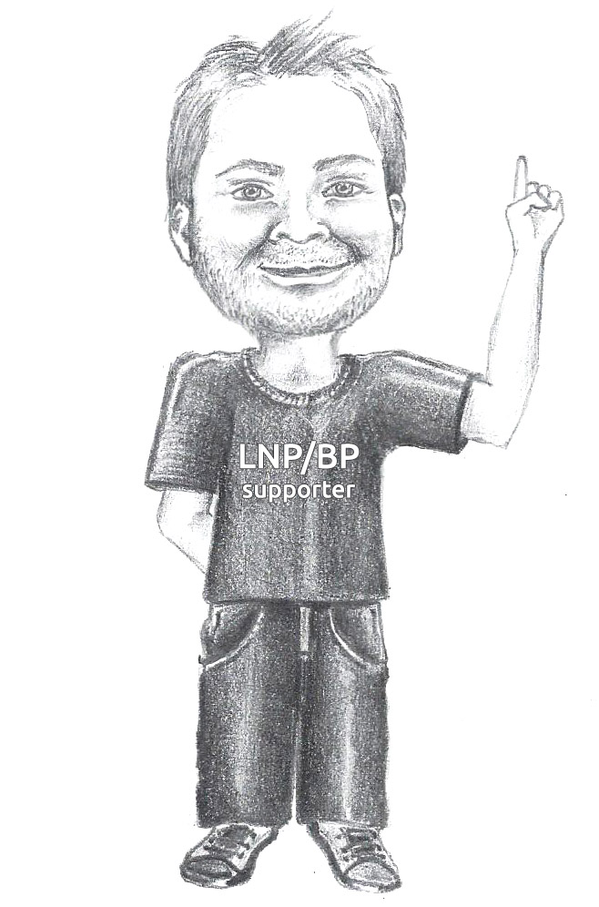

## How will the miners survive when all the bitcoins will be mined? ##

The reduction of the subsidy due to the miner decreases inexorably and will end.

It is not possible to proceed with infinite halving and the famous limit of 21 million bitcoins has been imposed as total supply.

It is estimated that after the 32nd halving the subsidy for miners will be 1 single satoshi per block, while there will no longer be any new satoshi from 2140.

**Then what incentive will the miners have to continue to mine?**

When a miner builds a block, he chooses transactions from various users and inserts them into his list (his **candidate block** ).

However, these transactions contain another monetary incentive, called **mining fee**.

Each user can establish a commission in order to entice the miner to include his transaction in the first available block.

Let&#39;s imagine that Alice wants to send 1 bitcoin to Bob: to make sure the transaction reaches Bob as soon as possible she decides to include in the latter a commission of 10,000 satoshis. Alice will then send 1.0001 bitcoins to Bob, including 1 for Bob and 0.0001 for the miner.

It can be deduced that the miner will want to create blocks with transactions containing generous fees, leaving the lower commission transactions to the following blocks.

The total reward that will be up to the miner who wins the mining competition will therefore be X new bitcoins + Y bitcoins already in circulation, where Y is the sum of all the transaction fees inside the block under construction.

Let&#39;s take a practical example.

A miner, one day in 2019, creates a candidate block in which there are 500 transactions, with an average of 1,000 satoshis as a fee per transaction.

His reward will be 12.5 bitcoins (new, subsidy) + 500,000 satoshis already in circulation (fees), or 12.50500000 bitcoins.

If the single bitcoin is worth 10,000 USD, the reward for this block will be 125.050 USD.

With the reduction of the reward in new satoshis the role of the mining fees will be increasingly important.

For this reason it is assumed that miners will give an increasingly high priority to transactions containing a higher fee.

Apparently this could be bad, because it would force Alice to spend ever higher amounts to pay Bob. In fact, if you remember, we said that the main purpose behind the creation of Bitcoin was to have a decentralized monetary system whose transactions were irreversible.

**The characteristic decentralization of the system and its security must be paid.**

Does this mean that it is impossible to use Bitcoin to perform micro-transactions?

Let&#39;s say that, at the beginning, Bitcoin was a cheap monetary system, useful to reduce the costs deriving from the presence of a reliable third party in the classic digital monetary system. The reason is simple.

The price per single unit was negligible, even less than 1 USD, and the value of the single satoshi was not even calculable.

It could therefore be used in micro-transactions because, if the cost of 1 kg of bread was 3 bitcoins (or 3 USD), you could afford to spend 0.0001 bitcoins of commissions (in the example 0.0001 USD).

**However, after a short period of time it was clear that a system, in order to be decentralized, safe and also cheap, must somehow scale.**

If the single bitcoin is worth a lot, the fees also increase in value considering the same amount of satoshis spent. If then the miners&#39; reward decreases, in addition to having the value of the fees on the rise, the satoshis necessary to speed up the transactions also increase.

It is therefore necessary for the system to scale up; that is to say that it adapts to the greater quantity of transactions and to the lesser quantity of new bitcoins for the miners, and that consequently allows to reduce the price per transaction rather than increase it over time.

The first solution, suggested by Nakamoto himself, was to increase the number of transactions that could be inserted into each block, by means of an increase in the size occupied by the block itself within the blockchain (block size).

In fact, Satoshi had inserted a limit to the block size (1 MB), to prevent the Bitcoin network from being filled with spam transactions at the beginning of its history, and consequently blocked, immediately losing its usefulness as an alternative payment system.

If this change had been made to the protocol and this limit had been removed or made variable, however, two serious problems could have occurred: the first, already mentioned, would have been the possibility of inserting spam transactions inside the blockchain, increasing the weight of the latter and slow down the network. But not only; miners would have been allowed to cheat.

A miner could in fact have generated false transactions for the sole purpose of quickly filling the block and arriving first at the Proof of Work, securing the prize.

The race to increasingly large blocks would have resulted in the creation of potential spam blocks as mentioned before, which would have been increasingly difficult to verify and would have required ever higher disk capacity to be stored.

As a hardware race took place by the miners to mine 1 MB blocks with increasingly high difficulty, so a specialization would also have occurred in the block verification.

Today anyone using low-performance hardware can verify transactions. In a reality where the blocks have no size limits, instead, only a few nodes would remain active.

Decentralization would become a utopia.

In short, even Satoshi is wrong.

But there is another method to increase the number of transactions while making them less expensive and maintaining decentralization of the system.

This method consists of using the Bitcoin network with its blockchain as a base layer to guarantee decentralization and irreversibility of transactions, and create layers above it in which to exchange value directly between peers, without resorting to a mining procedure.

The first and most famous Bitcoin second layer is called Lightning Network and we will explore it in the dedicated chapter.

This multi-level approach, which uses Bitcoin as a &quot;static&quot; network, whose modifications to the protocol are rare because the ultimate goal is to preserve decentralization, is the basis of the concept of LNP/BP, which we will clarify, also in this case, in a specific chapter.

Keep in mind, however, that claiming that most Bitcoin transactions have to move to a secondary layer in order to scale, does not mean that in the future the size of the blocks cannot or should not even be increased!

We should simply proceed with a cautious approach in order to preserve the decentralization level achieved by Bitcoin, aiming to saturate the basic network until there is actually a need for on-chain scaling solutions - never adjust what works - and above all develop fully second layers that can be used at full power maybe in ten or twenty years, but will be efficient, safe and available to billions of individuals and machines.

 Giacomo Zucco&#39;s note: &quot;Actually, the adoption of SegWit has led to what, to simplify, we could define an increase in the capacity of the blocks.
The block size is always around 1 MB, while the block weight, a new parameter introduced with the SegWit soft fork, can reach 4MB.
For more information, I invite you to read the _Understanding Segwit Block Size_ article by Jimmy Song [20].
