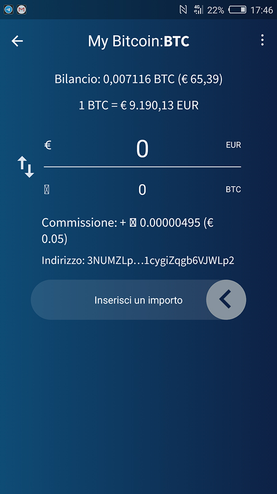

## How do you make a transaction? ##

Bitcoins, intended as coins in the classic sense of the term, do not exist: when bitcoins are exchanged, a public register is actually updated which certifies the ownership (the blockchain), signing transactions with your private key, the only data actually in your possession. So, you don&#39;t move bitcoins but update their ownership.

To understand the operation of the model used by Bitcoin to send the &quot;coins&quot;, I recommend reading Mastering Bitcoin by Andreas M. Antonopoulos, which explains precisely the concept of output and input of a transaction and how this is technically carried out in all its phases.

Here we will see instead how these transactions are carried out from the user&#39;s point of view, above all of the one who is a beginner or wants to immediately exchange money.

**Transactions on blockchain**

Blockchain transactions are currently considered to be classic transactions and constitute the vast majority of bitcoin movements within the system.

In the future these transactions will most likely be performed on special layers built on top of Bitcoins, called &quot;transaction layers&quot;. In the chapters _What is Lightning Network?_ and _Comparison between TCP/IP and LNP/BP_ I explain better what is meant by this definition.

Let&#39;s see how these classic transactions are carried out.

For this example I will use the Edge wallet by Airbitz Inc. but the steps are almost the same for Bitcoin Core or for any other type of wallet you choose to use.

Let&#39;s say that Alice wants to send 1 bitcoin to Bob and intends to execute a transaction on blockchain.

Alice will open her BTC wallet in which she has funds and will click on Send.

Here she will have to enter Bob&#39;s public address and specify the amount to send to him.

If you remember, in the chapter _Who created Bitcoin?_ we talked about public keys and private keys.

Bob&#39;s public address is an alphanumeric string derived from his public key: you can imagine the public address as an IBAN.

Example of public address 39EVqFcspspQRgNKPuugsbGrn5NN5QvUT9

When you make a wire transfer with your bank, you insert the name and surname (or company name) and the IBAN in the recipient field, to be sure that the funds actually go to the right recipient.

In Bitcoin it is as if we were using a disposable IBAN, which is a public address that we will change from time to time for security and privacy reasons.

Now Alice will see that, by setting 1 BTC as the amount to send, the application will calculate a mining fee that Alice will have to pay.

**This sending commission is paid to the miners who will enter the transaction in the Bitcoin blockchain** (see chapter _Who or what are the miners?_).
 This fee is a value that the user can establish: the higher it is, the greater the chance that the transaction will be inserted in the first available block and that it will therefore be confirmed quickly.

Alice in this case uses a good wallet and therefore can choose for herself how much to pay to the miners. Since she is in no hurry and Bob can wait 1 day for confirmation of the transaction, Alice decides to pay a low commission.

Everything I describe now runs in the background without showing it to the user, so don&#39;t be afraid, the process is much simpler and faster.

Let&#39;s assume that the 1 BTC transaction carried out by Alice to Bob will weigh 250 bytes on the Bitcoin blockchain and that Alice, by clicking on Low Commission, indirectly determines to spend 5 satoshis per byte. The application will calculate the commission that Alice will have to pay by simply multiplying 5 \* 250 bytes.

When Alice moves to the send screen, she will see that, for a 1 BTC transaction, she will have to pay 1,250 satoshis, or 0.00001250 BTC. In total, therefore, he will pay 1.00001250 bitcoins, of which 1 to Bob and 0.00001250 to the miner who will insert the transaction in the blockchain.

**Why do you have to pay a commission when you send money?**

When you make a digital payment you are probably used to thinking that transactions do not involve service fees: actually, when you pay with your credit/debit card, these commissions are covered by the recipient of the payment, for example the shopkeeper from whom you buy shoes.

**You should not think of transactions on Bitcoin as an alternative to those on Visa, Mastercard circuits etc.**

I used the term IBAN when I talked about a public address and I did it with full knowledge of the facts.
Basic Bitcoin transactions (via blockchain) are much more similar to international transfers.
Indeed, if compared to transfers between countries that do not have consolidated commercial relationships or that are not in the same free trade area (eg. EU), Bitcoin transactions are much cheaper!

Alice now reviews the transaction and authorizes it if she thinks the commissions are acceptable. If a transaction of this type were made while I was writing, Alice would have the possibility of transferring an equivalent value of around 10,000 dollars by paying a commission of 12.5 cents. I would say more than cheap!

Then, if we consider that Bob could be in any part of the planet, even several hours away from Alice, and would probably receive this large amount of money in less than a day and in total autonomy, I would say that the advantages of Bitcoin compared to the classic digital systems are obvious.

Bob receives 1 bitcoin from Alice and can spend it because he can sign future transactions with the private key corresponding to the address that received the funds: he can prove that he is the owner of that address and he has the right to move the money.

From a user perspective, the process is much simpler. If Bob wants to spend that money, he can do it the same way as Alice.

His wallet will perform a procedure that will not be shown to Bob and which I will explain very briefly below.

Once these funds are received, the wallet will show them &quot;on arrival&quot; but not yet confirmed. After some time the transaction will be written in the blockchain and then the wallet will show them &quot;confirmed&quot;.

Bob will be able to spend these funds even when they are in the &quot;on arrival&quot; state, but let&#39;s say he needs to spend them a few days after their confirmation.

Bob&#39;s wallet contains the private key corresponding to the public address he used with Alice: when Bob wants to spend his bitcoins, the wallet will sign the transaction with this private key, effectively authorizing payment, because it will show that he can move the funds. Only this private key can carry out transactions with the funds of that public address.

If you think about it, this is similar to what happens with the public key cryptographic system (RSA) for sending an encoded message on an unsafe channel. With the RSA system, Alice will be able to encrypt the message with Bob&#39;s public key and send it publicly. Bob will be the only one able to read the content of the message because this will be decodable only thanks to his private key, which he jealously guarded (see _Who created Bitcoin?_).

The blockchain transactions have a very high level of security regarding the irreversibility of the same, but they require some time to be confirmed by the network and above all, as we have seen, they involve fees which can be very high and which will still be more, if we look at the equivalent value in dollars, if the price of the single bitcoin should increase again.

**Transactions via Lightning Network**

Lightning Network is a payment protocol that represents a second layer above the basic Bitcoin layer.

We&#39;ll go into it in the dedicated chapter, but for the moment let&#39;s see it this way: Bitcoin is the basic layer, the one that guarantees the security of the system and the irreversibility of the transactions, Lightning is a network of payment channels that guarantees scalability (can be performed millions of transactions per second against about 7 Bitcoin transactions on blockchain), speed (network confirmations have not to be expected), privacy (payments are made directly between two users) and convenience (no commissions are paid to the miners, indeed they could be have completely free transactions).

**To hazard a comparison, Bitcoin is to international wire transfers as Lightning Network is to Visa and Mastercard.**

Lightning Network, due to the absence of the role of miners in transactions, is very useful for micropayments, ie most transactions that take place in everyday life.

Let&#39;s say that Alice has to pay Bob, her trusted baker, 100 satoshis for 1 kg of bread.

Alice will need to use a wallet compatible with Lightining Network.

In this example Alice uses BlueWallet, but consider that this is a semi-custodial wallet, so if you want to try some transactions on Lightning Network using this wallet, make sure you don&#39;t keep too many satoshis in it. Advanced user can also use BlueWallet in a non custodial way, linked to their personal full node.
Bob will show the bill to Alice and, with his Lightning Network compatible wallet, will generate an **invoice** from 100 satoshis.

Alice will open her wallet: she will now scan the QR Code from Bob&#39;s wallet and click Send.

Done.

Bob will receive the funds in a few seconds and these will already be expendable in security, because they won&#39;t have to be transcribed on the Bitcoin blockchain.

You will have noticed that in this type of transaction it is not Alice who must directly establish how many satoshis to send and to which public address, but it is Bob who must create a unique invoice which, once paid, will no longer be reusable. The invoice will become unusable even if it is not paid after a few minutes from its creation.

Transactions on Lightning Network are currently still little practiced and the network is still under development; they have still a lower level of security than blockchain transactions in terms of their irreversibility, but they are faster, privacy-oriented and above all allow you to move even very small amounts of money without commissions or almost, which is not feasible with transactions on the base layer. They even allow you to make payments in sub-satoshi, effectively eliminating any future liquidity problems in the Bitcoin system (see chapter _The &quot;danger&quot; of deflation in Bitcoin_).

In the years to come, probably, much simpler wallets will be created that will automatically choose the type of transaction to be performed, with maximum savings in time and fees for the user.

