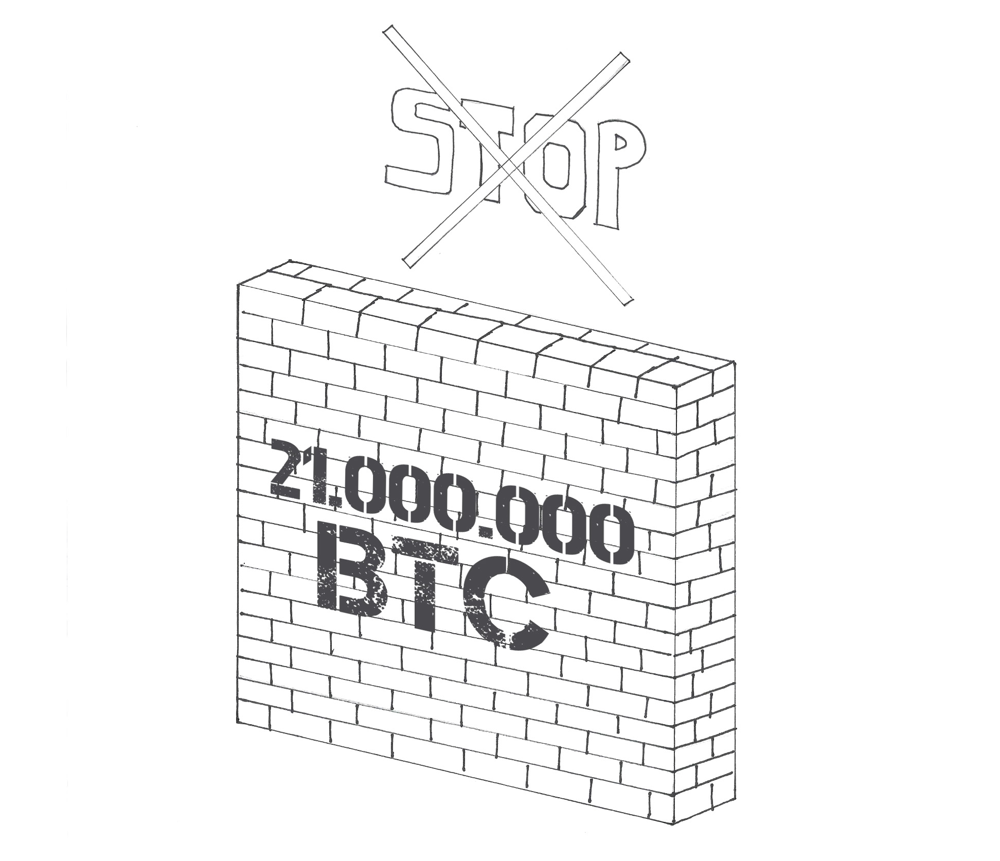

## Why is there a limit of 21 million bitcoin? ##

As mentioned earlier, when Satoshi created Bitcoin, in addition to the decentralization of the system itself, it also defined its economic policy.

Perhaps Satoshi was a black jack player and believed the system win on the dealer if it did not exceed 21 and therefore chose this symbolic number; we&#39;ll probably never know.

The fact is that he decided to impose a maximum number of bitcoins that could be created and &quot;cuts in production&quot;, called halving, to act on inflation: every 4 years the amount of new bitcoins put into circulation halved and the &quot;production&quot; of new units will end when 21 million are reached, so inflation will gradually decrease until it becomes deflation after the last unit is undermined.

It is often said that bitcoin - did you notice the small letter? - it is a rare asset, because there will only be 21 million units.

In reality, this is not the case.

We can define it as a &quot; **scarce asset**&quot; since a limit to its inflation, to the amount of &quot;coins&quot; that can be &quot;minted&quot;, has been established within the protocol, but it is certainly not uncommon or rare. Bitcoin can be defined as a &quot;scarce asset&quot;, because it has precisely one of the characteristics that make a good gain value: **scarcity**.

The famous 21 million bitcoins, which are not 21 anyway - approximating by excess will be 20999949.9769 in 2140 [18] - are only a useful convention to understand this limitation, in a jargon called total supply.

